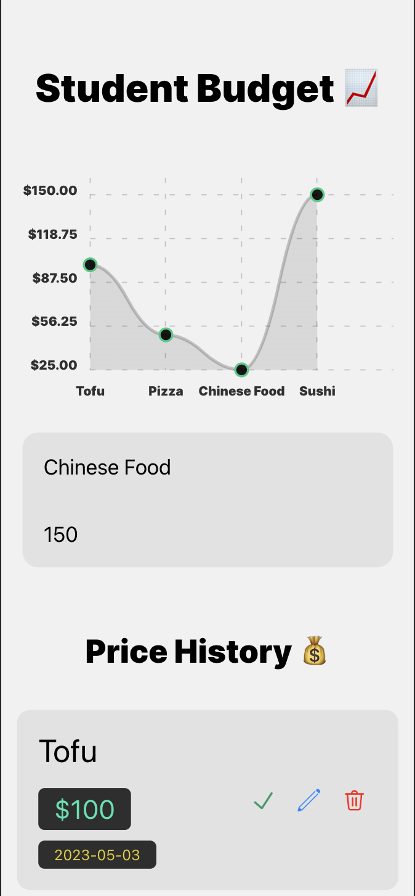
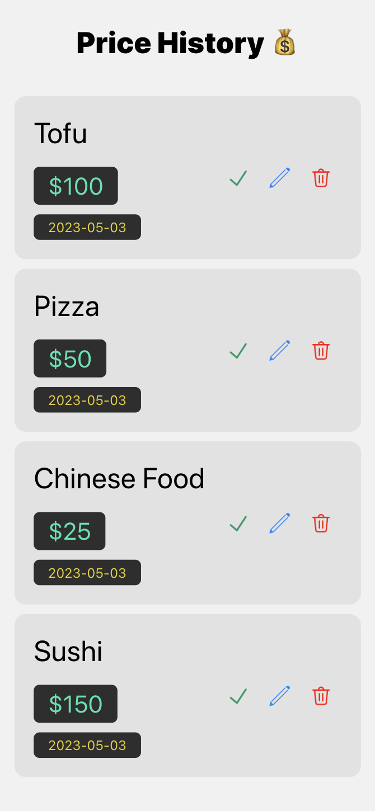

# Student Budget App

The app was created as an easy way to record items purchased! A simple way for students to visualize how much they are spending and when! 

## Demo

## Resources

- https://www.npmjs.com/package/react-native-chart-kit

## Dependencies

- npx expo install react-native-web@~0.18.10 react-dom@18.2.0 @expo/webpack-config@^18.0.1
- npm i uuid
- npm i prop-types
- npm i expo-constants
- npm i @expo/vector-icons
- npm i expo-linear-gradient
- npm i react-native-get-random-values
- npm i react-native-dropdownalert
- npm i @react-native-async-storage/async-storage
- npm i react-native-chart-kit
- npm i react-native-svg
- npm i --save-dev babel-plugin-rename-jsx-attribute <-- useless
- npm install -g expo-cli
- npx react-native-asset
- npx expo install @expo-google-fonts/inter expo-font

